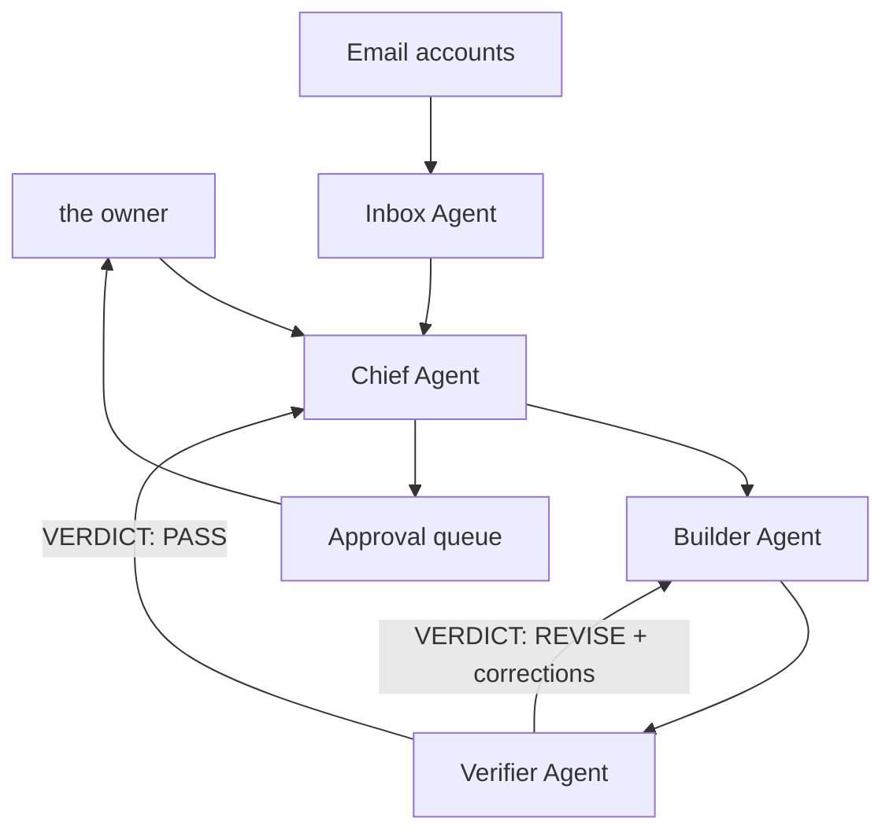

# Agent Command Center — architecture

Every agent, run record and approval decision belongs to the deployment's
owner (`OWNER_NAME`). The agents never act externally on their own.

## Four-agent operating model

### 1. Inbox Agent

- Reads only authenticated Gmail and Outlook accounts.
- Classifies messages by urgency, commitment, deadline, and project.
- Extracts work items and prepares reply drafts.
- Never sends, deletes, forwards, or changes an email without an approval policy allowing it.

### 2. Builder Agent

- Researches and implements the requested solution.
- Creates code, documents, plans, or structured recommendations.
- States assumptions and supplies completion criteria.
- Receives exact corrections from Verifier and revises the work.

### 3. Verifier Agent

- Reviews Builder output independently.
- Checks correctness, completeness, security, edge cases, and test coverage.
- Opens every reply with `VERDICT: PASS` or `VERDICT: REVISE`, then lists numbered corrections.
- A `REVISE` verdict sends the work back to Builder and re-checks the result.

### 4. Chief Agent

- Owns the final outcome and decides which specialists to activate.
- Tracks handoffs, blockers, retries, and completion criteria.
- Resolves disagreements between Builder and Verifier.
- Creates the final package and routes external actions to the approval queue.

## Run lifecycle

A mission is an event stream, not a single blocking call. `lib/orchestrator.ts`
is an async generator; `POST /api/mission` forwards each event to the browser
over Server-Sent Events when the caller asks for `text/event-stream`, and
collects the same events into one JSON body otherwise.

| Event | Meaning |
| --- | --- |
| `run.started` | Routing plan is fixed; active and skipped agents are known. |
| `agent.started` | An agent call is going out, with its provider, model, and token ceiling. |
| `agent.retry` | A provider failed; the attempt record says why and how long the backoff is. |
| `agent.completed` | Output, token usage, cost, latency, and any fallback provider used. |
| `agent.skipped` | Auto Router decided this agent is unnecessary for the request. |
| `revision.requested` | Verifier returned corrections; Builder is revising. |
| `run.completed` | Final package, approval queue, routing table, and run totals. |
| `run.failed` | Safe stop. `cancelled: true` distinguishes an aborted run from a failure. |

Closing the browser tab aborts the request, which aborts the in-flight gateway
calls. An abandoned run stops costing money.

## Approval modes

| Mode | Behavior |
| --- | --- |
| Prepare for my approval | Default. Agents may analyze and draft, but every external write waits. |
| Run safe steps automatically | Read-only and isolated internal work may run; risky actions wait. |
| Autonomous within policy | Only explicitly allowlisted tools and limits can execute automatically. |

Email sending, deletion, purchases, production deployment, credential changes,
and destructive operations always remain approval-gated. The classifier detects
irreversible verbs directly and, when it finds one, forces Chief and Verifier
into the run and adds a named high-risk item to the approval queue. Approving an
item records an audit decision; the workspace still performs no external action.

## Provider portability

The dashboard calls a standard OpenAI-compatible gateway. A LiteLLM proxy can
route individual agents to any supported model without changing application
code. Provider API keys belong in the gateway or encrypted hosting secrets, not
in the browser or the Git repository.

Route capability lives in data, not in code: tier, per-million prices, context
window, and six capability scores per route are environment values, so adding or
re-ranking a provider is configuration rather than a code change.

## Automatic model routing

`Auto · Smart route` is the default for every agent. The routing sequence is:

1. Score the request across nine signals (quick text, email, coding,
   implementation, freshness, long document, risk, irreversibility, analysis)
   and pick the highest-scoring class. Scoring is additive, so a short reply that
   merely mentions a doctor or a contract is not escalated into a high-stakes run.
2. Activate only the necessary agents. A small rewrite uses Builder alone;
   complex coding uses Chief, Builder, and Verifier; an irreversible action
   always adds Chief and Verifier.
3. Set a task-specific output-token cap for each active agent.
4. Drop routes whose context window cannot hold the request, then rank the rest
   by role-specific capability, cost tier, exact prices when configured, and
   freshness or context needs.
5. Use a manual provider only when the owner overrides `Auto` for that agent.
6. Retry the next ranked provider after rate limits or transient gateway failures.

| Request | Typical workflow | Routing priority |
| --- | --- | --- |
| Short rephrase or grammar fix | Builder only | Free/lowest-cost capable model |
| Email review or reply | Inbox + Builder | Efficient writing model |
| Current research | Builder + Verifier | Research and source-aware model |
| Coding, debugging, and tests | Chief + Builder + Verifier | Coding strength and independent review |
| High-stakes or long-context work | Chief + Builder + Verifier, plus Inbox when relevant | Quality, context handling, and reliability |

The router never assumes that a consumer subscription provides API entitlement.
Each provider must be exposed through the configured gateway.

The Connections manager keeps provider and account availability user-controlled.
Adding a provider places it back in Auto Router's candidate pool; removing it
excludes it and resets any agent override that points to it. Gmail and Outlook
can be added or removed as Inbox context sources. Approval policy remains
mandatory and cannot be removed because external writes must stay gated.

## Reliability

- Every gateway call has a hard timeout; a hung provider cannot hang a run.
- Retryable failures (408, 409, 425, 429, 5xx, network errors) are retried with
  exponential backoff and full jitter, honouring `Retry-After`.
- Non-retryable failures (bad key, unknown model) skip straight to the next
  provider instead of burning the retry budget.
- Token usage comes from the provider response when present and is estimated
  locally when absent; the result is flagged either way.

## Storage

Cloudflare D1 holds three tables: `runs`, `agent_steps`, and `approvals`. With a
`DB` binding, history and approval decisions survive refreshes, devices, and
redeploys, and every read is scoped to the owner id. Without a binding, the app
degrades to browser-local history and says so in the interface rather than
failing.

## Access control

| Control | Default | Purpose |
| --- | --- | --- |
| `REQUIRE_SIGNED_IN` | `false` | Refuse anonymous mission runs. |
| `MISSION_API_TOKEN` | unset | Shared secret for scripted callers (`x-mission-token`). |
| `RATE_LIMIT_RUNS_PER_MINUTE` | 6 | In-memory burst protection per identity. |
| `RATE_LIMIT_RUNS_PER_DAY` | 120 | Durable daily cap counted in D1. |

The per-minute limiter lives in the Worker isolate, so it is best-effort across
colos; the daily cap is the durable one.

## API surface

| Route | Purpose |
| --- | --- |
| `POST /api/mission` | Run a mission. SSE with `Accept: text/event-stream` or `?stream=1`, JSON otherwise. |
| `GET /api/status` | Gateway readiness, configured routes, storage state, limits. No secrets. |
| `GET /api/runs` | Durable run history for the signed-in owner. |
| `GET /api/runs/:runId` | One stored run with its agent steps and approval queue. |
| `POST /api/runs/:runId/approvals/:approvalId` | Record an approve or reject decision. |

## Tests

`npm test` runs 97 unit tests over `tests/*.test.ts` with no build step and no
external services: classifier and routing decisions, cost arithmetic,
gateway retry, fallback, timeout and cancellation behaviour, the orchestrator
event sequence and revision loop, identity parsing, and rate limiting.

## Current implementation boundary

The published version includes the command-center workflow, automatic and manual
model selection, task classification, agent minimization, token budgets,
fallback routing, streaming mission execution, the revision loop, the approval
queue, durable run history, and a deterministic routing preview. Live model
execution activates when the gateway environment values are configured. Direct
email ingestion inside an independently hosted deployment still needs an OAuth or
MCP bridge; until that bridge is added, Inbox Agent must not claim it has read a
message, and the preview output says so explicitly.

## Tenancy

Stored rows are owned by a platform user id. Anonymous visitors share no owner
id and therefore own nothing: their runs stay in their own browser, and the
history, run-detail and approval endpoints return nothing durable for them.
Durable history is a signed-in feature. `docs/HARDENING.md` records why.

## Verification

| Command | What it proves |
| --- | --- |
| `npm run verify` | Types, lint, and 97 unit tests (no build, no network). |
| `npm run test:e2e` | 53 checks against the built Worker over real HTTP, in three phases: functional, live gateway, rate limiting. |
| `npm run doctor` | Which model routes actually answer, with latency, tokens, cost, or the precise failure. |
| `npm run gateway:fake` | A stand-in provider for exercising retries, fallback and the revision loop offline. |
